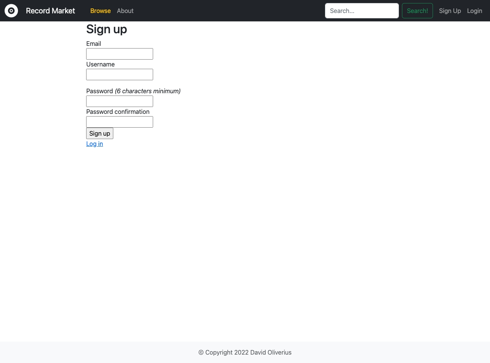

# T2A2 - Two-Sided Marketplace Assignment - Coder Academy

## David Oliverius - Melbourne, Web Dev Standard 2022

#### Project URL: https://record-market.herokuapp.com/

#### Github URL: https://github.com/DavidOliverius/record_market

---

## Identification of the problem you are trying to solve by building this particular marketplace app
---
**Record Market** is designed to solve the problem of vinyl record collectors and affocionados find each other to buy and sell used records, allowing users from around the globe find a specific hard to find record. 
  

## Why is it a problem that needs solving?
---
Gone are the days of physically 'digging' for records at your local vinyl record shop hoping to find the gem you've been searching years for, or come across something unexpected. Now you can use Record Market to find hidden gems from a much wider array of people than just those that interact with your local vinyl store.
  
## Description
---
### Purpose
A marketplace for second-hand used Vinyl Records, primarily focused on electronic club music and a direct competitor with Discogs with a boutique focus - allowing users to both buy and sell records.
  

### Functionality and Features
- User account and authentication
- Create vinyl listings
- Buy vinyl listings
- Order history
  

### Sitemap

  

### Screenshots

<details>
    <summary>Expand</summary>





</details>

### Target Audience

  

### Tech Stack

**Frontend:**
- HTML
- CSS
- Bootstrap

**Backend**
- Ruby 2.7.5
- Ruby on Rails 7.0.3
- PostgreSQL

**Deployment**
- Heroku
- AWS S3 - active storage


## User Stories
---
- As a seller, I want to be able to list my used records for sale
- As a seller, I want to be able to upload a photo of my record
- As a seller, I want to see who bought my listing
- As a buyer, I want to know what condition the record I'm purchasing is in
- As a buyer, I don't want anyone else to be able to purchase the same record I do
- As a user, I want to have control of my listing
- As a user, I want to have secure login to my account 
- As a user, I want to change my username
- As a user, I want my username to be clear to a potential buyer
- As a user, I want search for records I'm interested in
- As a user, I want to have the ability to delete my account
  
## Wireframes
---
<details>
    <summary>Expand</summary>


</details>

## ERD
---


## High-level Components
---
Underwriting the entire project is Ruby on Rail's MVC architecture, separating and dividing application logic. In conjunction with Rails, PostgreSQL is used as the database management system so that data persists between sessions, both in development and deployment.

The **Model** interacts directly with the database, and each Model within the Rails project correlates with a table in the project's PostgreSQL database. The Models allow associations between other Models to be set in conjuction with the schema, and then foreign keys can be set and data can be manipulated between different Models thanks to Rails' Active Record. Active Record has a plethora of in-built methods to access and manipulate data within the Models. For example, using the Rails console and entering the following returns the first entry on the Listings table from the database.
```ruby
@listings.first

=> #<Listing id: 1, title: "Disconnected", artist: "Sohrab", label: "Undersound Recordings", condition: "very_good", price: 35, sold: nil, user_id: 1, genre_id: 2, created_at: "2022-07-07 09:51:55.960959000 +0000", updated_at: "2022-07-07 23:32:54.536706000 +0000">
``` 
You can then use the columns on the table to further specify data:
```ruby
@listings.first.artist

=> "Sohrab"
```

These methods are built in to Ruby from when the project is first generated, and allow powerful and easy interactions with the database.

CRUD operations can also be undertaken with these methods, allowing intuitive ways of updating and deleting records from the database.
```ruby
@listings.update(:all, sold: false)

=> [#<Listing id: 1, title: "Disconnected", artist: "Sohrab", label: "Undersound Recordings", condition: "very_good", price: 35, sold: false, user_id: 1, genre_id: 2, created_at: "2022-07-07 09:51:55.960959000 +0000", updated_at: "2022-07-10 07:57:03.712234000 +0000">, #<Listing id: 2, title: "Bubbleland", artist: "Monosphere", label: "Monodisk", condition: "very_good", price: 100, sold: false, user_id: 1, genre_id: 11, created_at: "2022-07-08 00:12:30.782631000 +0000", updated_at: "2022-07-10 07:57:03.727785000 +0000">]
```
With one simple command you can change all of the records in your database quickly, which can have a dramatic impact on your project and make testing and debugging a breeze.

The **Controllers** work together to handle requests to and from the View and the Model. Methods defined within specific controllers tell the application how to handle specific requests from Users, and how those requests should interact with the Model.  
## Third Party Services
---
#### Devise
Devise handles user accounts, including the login/sign up pages, password encryption and authentication. Allows easy authorisation with `before_action :authenticate_user` to any controller you want to limit access to. 
#### Bootstrap
Popular open source CSS framework to allow simple and easy styling for the project.
#### Heroku
Free service for deployment, allows CLI access to push repository directly to production very easily.
#### AWS S3
Enables persistence of image uploads for deployment. S3 bucket set up with private key so only the Rails project can upload new images.
#### Ransack
Enables search function on listings, searches in specific keys on listings and returns results.
#### PostgreSQL
Powerful open source SQL database management system. Required for Heroku deployment.

## Describe your projects models in terms of the relationships they have with each other
---
### User Model
- A User has many Listings, allowing them to make as many as they would like and giving them control over any Listings they create. For Listings the User owns, they are allowed to edit any data associated with that Listing and they can delete the Listing entirely if they wish.
- A User has many sold orders. As Users have many listings, each of these listings can potentially be sold as well. When a Listing is bought a seller_id is created on the Order model associating the seller with the Listing and the Order.
- A User has many bought orders. Users can buy as many listings as they wish. Conversely, when a User purchases a Listing a buyer_id is created on the Order associating the buyer with the Listing and the Order.

### Listing Model
- A Listing belongs to a User, that is, a listing can only be controller by the User that created it.
- A Listing belongs to a Genre. Every record Listing has an associated Genre that can be selected via a dropdown menu.
- A Listing has rich text. There is the option for Users to enter a description of the record with each Listing.
- A Listing has one attached cover - this utilises active storage so that each Listing can be submitted to the database with a picture of the record cover that gets displayed with each Listing.
### Order Model
- An Order belongs to a Listing. Each Order refers directly to a Listing that was submitted by a User.
- An Order belongs to a Buyer. This associates the Order with the foreign key of the User that buys the Listing.
- An Order belongs to a Seller. This associates the Order with the foreign key of the User that sold the Listing.

## Discuss the database relations to be implemented in your application
---
In line with the ERD, the database relations implemented within the project are as follows:

### Users
The Users table stores essential personal information for user accounts and relates directly to both the Orders and Listings tables.
- Users ID primary key is a foreign key for the buyer_id and seller_id in the Orders table so that the relationship between which user bought and sold which listing can be ascertained. This is a one to many relationship as one user can buy or sell many records.
- User ID primary key is a foreign key on the Listings table as user_id so that the relationship between which user created which listing can be ascertained. This is a one to many relationship as a one user can have many listings.

### Orders
The Orders table primarily links together the Users and Listings tables so that once a User finds a Listing they wish to purchase, a new order is created and the database relationships that have been set up allow a clean new table to be formed with foreign keys from User and Listings so that Orders can be tracked.
- The listing_id is a foreign key associated with the primary key of the Listings table. As only one listing can belong to one order, this is a one to one relationship.
- The buyer_id is a foreign key associated with the primary key of the Users table. One user can buy many orders but each order is unique.
- The seller_id is a foreign key associated with the primary key of the Users table. One user can sell many orders but each order is unique.

### Listings
The Listings table is the heart of the data for this project as it is displayed prominently on the home page and is made up of all of the Listings that all of the Users wish to sell on the platform.
- The Listings table primary key is a foreign key for the listing_id on the Orders table. This associates a particular Listing with a specific order and ties it to the Users associated with that order. Each Listing can only have one unique Order.
- The user_id is a foreign key associated with the primary key on the Users table so that the relationship between which user controls/owns which listing can be established.
- The genre_id is a foreign key associated with the primary key on the Genres table so that Users can select which genre is associated with each particular listing.

### Genres
The Genres table has a preset selection of Genres for Users to select when they create their listings.
- Genres ID is a primary key that is associated with the genre_id foreign key on the Listings table. 


## Database Schema Design
---

<details>
    <summary>Expand</summary>

```ruby
ActiveRecord::Schema[7.0].define(version: 2022_07_05_024026) do
  enable_extension "plpgsql"

  create_table "action_text_rich_texts", force: :cascade do |t|
    t.string "name", null: false
    t.text "body"
    t.string "record_type", null: false
    t.bigint "record_id", null: false
    t.datetime "created_at", null: false
    t.datetime "updated_at", null: false
    t.index ["record_type", "record_id", "name"], name: "index_action_text_rich_texts_uniqueness", unique: true
  end

  create_table "active_storage_attachments", force: :cascade do |t|
    t.string "name", null: false
    t.string "record_type", null: false
    t.bigint "record_id", null: false
    t.bigint "blob_id", null: false
    t.datetime "created_at", null: false
    t.index ["blob_id"], name: "index_active_storage_attachments_on_blob_id"
    t.index ["record_type", "record_id", "name", "blob_id"], name: "index_active_storage_attachments_uniqueness", unique: true
  end

  create_table "active_storage_blobs", force: :cascade do |t|
    t.string "key", null: false
    t.string "filename", null: false
    t.string "content_type"
    t.text "metadata"
    t.string "service_name", null: false
    t.bigint "byte_size", null: false
    t.string "checksum"
    t.datetime "created_at", null: false
    t.index ["key"], name: "index_active_storage_blobs_on_key", unique: true
  end

  create_table "active_storage_variant_records", force: :cascade do |t|
    t.bigint "blob_id", null: false
    t.string "variation_digest", null: false
    t.index ["blob_id", "variation_digest"], name: "index_active_storage_variant_records_uniqueness", unique: true
  end

  create_table "genres", force: :cascade do |t|
    t.string "name"
    t.datetime "created_at", null: false
    t.datetime "updated_at", null: false
  end

  create_table "listings", force: :cascade do |t|
    t.string "title"
    t.string "artist"
    t.string "label"
    t.integer "condition"
    t.integer "price"
    t.boolean "sold"
    t.bigint "user_id", null: false
    t.bigint "genre_id", null: false
    t.datetime "created_at", null: false
    t.datetime "updated_at", null: false
    t.index ["genre_id"], name: "index_listings_on_genre_id"
    t.index ["user_id"], name: "index_listings_on_user_id"
  end

  create_table "orders", force: :cascade do |t|
    t.bigint "listing_id", null: false
    t.bigint "buyer_id", null: false
    t.bigint "seller_id", null: false
    t.datetime "created_at", null: false
    t.datetime "updated_at", null: false
    t.index ["buyer_id"], name: "index_orders_on_buyer_id"
    t.index ["listing_id"], name: "index_orders_on_listing_id"
    t.index ["seller_id"], name: "index_orders_on_seller_id"
  end

  create_table "users", force: :cascade do |t|
    t.string "email", default: "", null: false
    t.string "encrypted_password", default: "", null: false
    t.string "reset_password_token"
    t.datetime "reset_password_sent_at"
    t.datetime "remember_created_at"
    t.string "username"
    t.datetime "created_at", null: false
    t.datetime "updated_at", null: false
    t.index ["email"], name: "index_users_on_email", unique: true
    t.index ["reset_password_token"], name: "index_users_on_reset_password_token", unique: true
  end

  add_foreign_key "active_storage_attachments", "active_storage_blobs", column: "blob_id"
  add_foreign_key "active_storage_variant_records", "active_storage_blobs", column: "blob_id"
  add_foreign_key "listings", "genres"
  add_foreign_key "listings", "users"
  add_foreign_key "orders", "listings"
  add_foreign_key "orders", "users", column: "buyer_id"
  add_foreign_key "orders", "users", column: "seller_id"
end
```

</details>

## Task Tracking

Planning and tracking of tasks was done on Trello. From the outset, I entered each criteria of the rubric and divided documentation/code criteria into separate columns and kept them at the start of the Trello board for constant visibility. From there, I divided tasks into a To-Do section, a WIP section for what I was currently working on, and then a Review and Done section too. As the project progressed and I was overwhelmed by what I could get done, I created a new 'Maybe' section for optional extras that I may not be able to get to. This enabled me to focus on what was essential and keep progressing at a good pace. 

Trello Project URL: https://trello.com/b/f4FrGtDg/t2a2-marketplace-assignment